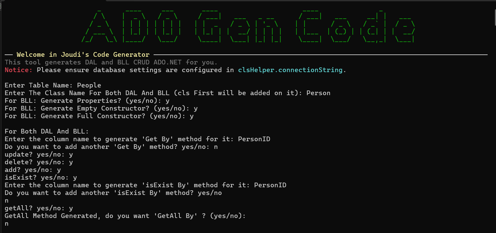

# ADO.NET 3-Tier Code Generator 🚀

[Read in Arabic ](README-ar.md)

A powerful, interactive Command Line Interface (CLI) tool built with C# to completely automate the generation of Data Access Layer (DAL) and Business Logic Layer (BLL) code for ADO.NET 3-Tier architecture projects.

Writing boilerplate CRUD operations manually is time-consuming and error-prone. This tool reads your database schema and instantly generates secure, ready-to-use C# classes, saving you hours of repetitive work.

## ✨ Features
* **Automated CRUD Generation:** Instantly generates methods for Add, Update, Delete, Get All, Get By ID, and Check Exists.
* **Smart Validation:** Automatically connects to your database to verify table names and columns before generating code, preventing typos and runtime crashes.
* **Modern CLI Experience:** Built with `Spectre.Console` to provide a beautiful, interactive, and colorful user interface with keyboard navigation.
* **SQL Injection Proof:** Generated code safely handles `DBNull` values and strictly uses SQL Parameters.
* **Highly Customizable:** Pick and choose exactly which columns and methods you want to generate.

## 📸 Screenshots

## 🛠️ How to Use
1. Clone the repository and open the solution in Visual Studio.
2. Open `clsHelper.cs` and update the `connectionString` to point to your local SQL Server database.
3. Run the application.
4. Enter your target Table Name and Class Name.
5. Follow the interactive prompts to select the columns and methods you need.
6. Copy the generated DAL and BLL code from the console directly into your project!

## 💻 Tech Stack
* C# / .NET
* ADO.NET
* SQL Server
* [Spectre.Console](https://spectreconsole.net/) (For the interactive UI)

---
**Developed with ❤️ by Joudi**
* **LinkedIn:** [Joudi Mohammad](https://www.linkedin.com/in/joudi-mohammad-002685283)
* **Telegram:** [@Joudi_Adeeb](https://t.me/Joudi_Adeeb)
